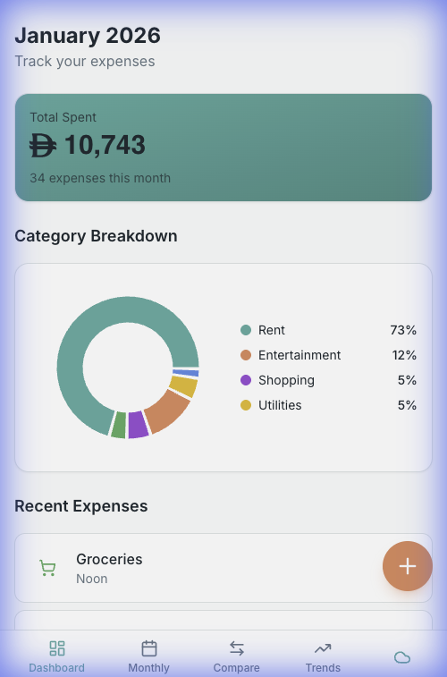
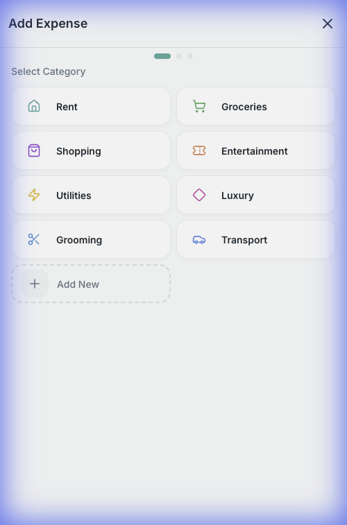
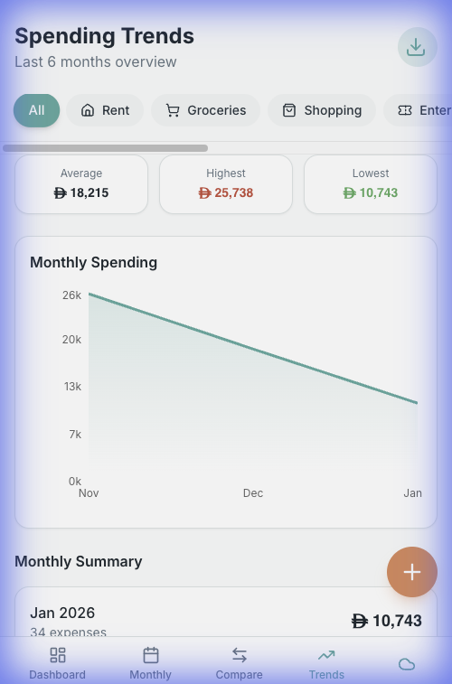

# Expense Buddy

A personal expense tracking application with a React frontend and Express.js backend.

## Screenshots

<div align="center">
  
  
  
</div>

## Features

- Automatic Sync: Changes are automatically synced to the server when online (debounced by 2s).
- Offline-First and Optimistic UI: Works perfectly offline with zero-lag interface; changes update locally instantly while syncing in the background.
- Race-Condition Protection: Built-in duplicate submission prevention for network-intensive operations.
- Expense Tracking: Categorize spending across predefined and custom categories.
- Subcategories: Organize expenses with granular subcategories for better insights.
- Edit and Delete: Long-press on any expense to modify or remove it.
- Refund Support: Negative amount support for refunds and returns.
- Detailed Breakdowns: View expenses by month with comparisons and trends.
- Visual Analytics: Interactive charts showing spending habits.
- Export to CSV: Download your data via the Trends view for external analysis.
- Historical Import: One-time CSV import for bringing in existing data.
- Hybrid Storage: Persistent SQLite on server + IndexedDB in the browser.
- Premium UI: Modern, responsive design with Tailwind CSS and Framer Motion.

## Data Import and Export

### Exporting Data
You can export all your expense data to a CSV file by clicking the Download Icon in the header of the Spending Trends view. This will download a file named expenses-export.csv.

### Importing Historical Data (One-time)
If you have historical data in a CSV file, you can import it directly into the database using the provided import script.

1. Prepare your CSV file with the following headers (or in this order):
   date,amount,category,subcategory,note
   Example: 2023-12-01,150.50,Groceries,Carrefour,Weekly groceries

2. Run the import command:
   ```sh
   npx tsx server/src/import-csv.ts path/to/your/file.csv
   ```


## Getting Started

### Prerequisites

- Node.js and npm installed

### Installation

```sh
# Clone the repository
git clone <YOUR_GIT_URL>

# Navigate to the project directory
cd expense-buddy

# Install dependencies
npm install
```

### Running the Application

#### Option 1: Run Both Frontend and Backend (Recommended)
```sh
npm run dev:fullstack
```
This starts:
- Frontend on http://localhost:8080
- Backend API on http://localhost:3001

#### Option 2: Run Separately

**Backend only:**
```sh
npm run server
```

**Frontend only:**
```sh
npm run dev
```

### Other Commands

```sh
# Build for production
npm run build

# Build backend for production
npm run server:build

# Run linting
npm run lint

# Preview production build
npm run preview
```


## Technology Stack

### Frontend
- React 18 - UI framework
- TypeScript - Type safety
- Vite - Build tool and dev server
- Tailwind CSS - Styling
- shadcn-ui - UI component library
- Framer Motion - Animations
- React Router - Routing
- date-fns - Date utilities
- Recharts - Data visualization

### Backend
- Express.js - REST API server
- SQLite - Database (via better-sqlite3)
- TypeScript - Type safety
- CORS - Cross-origin resource sharing

## Project Structure

```
expense-buddy/
├── src/                    # Frontend source code
│   ├── components/        # React components
│   │   ├── ui/           # shadcn-ui components
│   │   └── views/        # Main view components
│   ├── context/          # React Context (state management)
│   ├── lib/              # Utilities and API client
│   ├── pages/            # Page components
│   └── App.tsx           # Root component
├── server/                # Backend source code
│   ├── src/
│   │   ├── database.ts   # Database initialization
│   │   └── index.ts      # Express server and API routes
│   ├── expenses.db       # SQLite database (generated)
│   └── README.md         # API documentation
├── public/               # Static assets
└── package.json          # Dependencies and scripts
```

## API Documentation

See [server/README.md](server/README.md) for complete API documentation.

## Integration Guide

See [INTEGRATION.md](INTEGRATION.md) for details on how the frontend and backend are connected.

## Mobile and Safari Support (PWA)

This app is designed to be used as a Progressive Web App (PWA).

### Installing on iOS (Safari)
1. Open the app in Safari on your iPhone/iPad.
2. Tap the Share button (square with an up arrow).
3. Scroll down and tap Add to Home Screen.
4. Launch the app from your Home Screen for the full App experience and reliable offline support.

### Note on Offline Mode
The app uses Service Workers for offline support. In development mode, PWA features are enabled but may require a refresh to activate. For best results, use the production build (npm run build).

## Database Schema

### expenses
```sql
CREATE TABLE expenses (
  id TEXT PRIMARY KEY,
  amount REAL NOT NULL,
  category TEXT NOT NULL,
  subcategory TEXT,
  date TEXT NOT NULL,
  note TEXT,
  created_at TEXT DEFAULT CURRENT_TIMESTAMP
)
```

### subcategories
```sql
CREATE TABLE subcategories (
  id INTEGER PRIMARY KEY AUTOINCREMENT,
  category TEXT NOT NULL,
  name TEXT NOT NULL,
  UNIQUE(category, name)
)
```

## Environment Variables

Create a `.env` file in the root directory:

```bash
# API Configuration
VITE_API_URL=http://localhost:3001/api
```

## Contributing

Feel free to submit issues and enhancement requests!

## License

MIT
